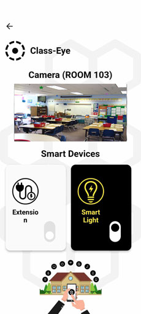
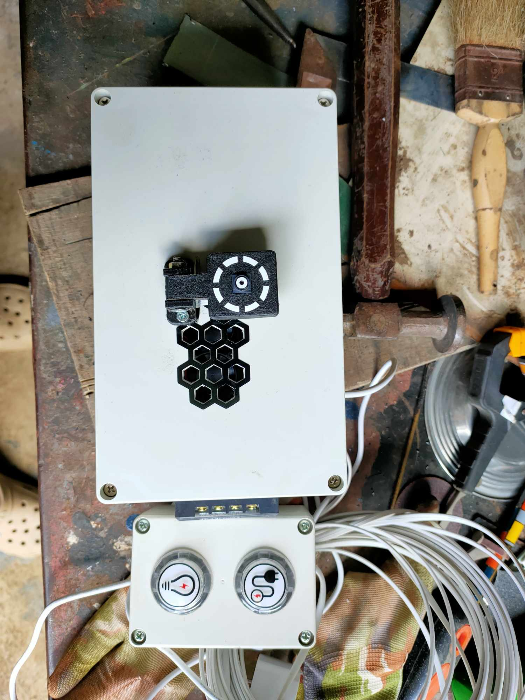
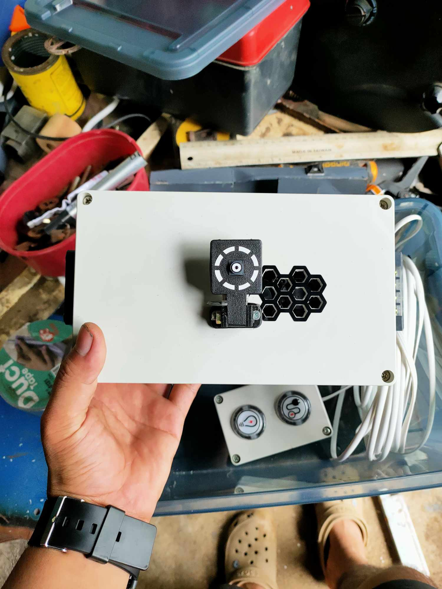

# Smart Light & Socket Control System

This project is an IoT-based **smart home control system** that allows users to remotely control **lights and electrical sockets** using a **Flutter mobile application**. It integrates an Arduino device, a Python server, Firebase Realtime Database, and computer vision for automation.

---

## Project Overview

The system consists of four main components:

1. **Arduino Device (Hardware Control)**
2. **Python Server (Processing & Automation)**
3. **Firebase Realtime Database (Cloud Sync)**
4. **Flutter Mobile App (User Control Interface)**

The system enables:
- remote control of lights and sockets  
- real-time synchronization via Firebase  
- automatic shutdown when no person is detected  
- live camera monitoring  

---

## Features

### 💡 Remote Light & Socket Control
- Control:
  - Light (ON/OFF)
  - Electrical socket / extension (ON/OFF)
- Controlled via Flutter app  
- Synced in real-time using Firebase  

---

### 📱 Flutter Mobile Application
- User-friendly interface  
- Toggle switches for:
  - light  
  - socket  
- Real-time updates from Firebase  
- Acts as remote controller  

---

### ☁️ Firebase Integration
- Stores device states:
  - light status  
  - socket status  
- Enables real-time communication between:
  - mobile app  
  - Python server  
  - Arduino  

---

### 🔄 Arduino Hardware Control
- Receives commands via Serial  
- Controls relays for:
  - light  
  - socket  
- Sends feedback signals:
  - `"l"` → light toggled  
  - `"e"` → extension toggled  

---

### 🎥 Live Camera Streaming
- Uses OpenCV camera  
- Streams video via Flask server  
- Accessible through endpoint:
http://<server-ip>:8000/video_feed

---

### 🧍 Human Detection Automation
- Uses **HOG (Histogram of Oriented Gradients)** detection  
- Detects human presence  

#### Behavior:
- If no person detected for a period:
  - automatically turns OFF light and socket  
- Helps save energy  

---

## System Workflow

### 1. Manual Control (Flutter App)
- User toggles light/socket in app  
- Firebase updates value  
- Python server listens to changes  
- Sends command to Arduino via Serial  

---

### 2. Arduino Execution
- Arduino receives command:
  - `"0"`, `"1"`, `"2"`, `"3"`  
- Controls relay accordingly  

---

### 3. Feedback Loop
- Arduino sends:
  - `"l"` → light changed  
  - `"e"` → socket changed  
- Python updates Firebase  
- Flutter app reflects new state  

---

### 4. Automatic Mode (AI Detection)
- Camera detects human presence  
- If no person detected:
  - system turns OFF devices automatically  

---

## Code Reference

### Python Server
:contentReference[oaicite:0]{index=0}  

Handles:
- Firebase streaming  
- Serial communication  
- Camera streaming  
- Human detection  

---

## Hardware Components

- Arduino (Uno / Mega)  
- Relay Module (2-channel or more)  
- Light (Bulb / LED)  
- Electrical Socket / Extension  
- USB Camera  
- Computer / Orange Pi / Raspberry Pi (for Python server)  

---

## Software Components

### Python Server
- OpenCV (camera + detection)  
- Flask (video streaming)  
- Pyrebase (Firebase integration)  
- PySerial (Arduino communication)  

---

### Flutter App
- Firebase Realtime Database  
- Toggle UI for device control  

---

### Arduino
- Serial communication with Python  
- Relay control logic  

---

## Communication Logic

| Code | Meaning        |
|------|----------------|
| "0"  | Both OFF       |
| "1"  | Light ON       |
| "2"  | Socket ON      |
| "3"  | Both ON        |

---

## API Endpoint

### Video Stream

Endpoint: /video_feed

Access via browser: http://<server-ip>:8000/video_feed

---

## Notes

- Serial port must match the connected device (e.g., `/dev/ttyUSB0`)  
- Ensure camera is properly connected and accessible  
- Firebase configuration must be correct  
- Use stable power supply for relay modules  
- Adjust camera resolution and FPS for better performance  

---

## Limitations

- Requires Python server to run continuously  
- No authentication/security layer implemented  
- Uses basic HOG-based human detection (not AI deep learning)  
- No offline functionality (requires internet for Firebase)  

---

## Summary

This project demonstrates a complete **IoT smart control system** that combines:

- embedded systems (Arduino)  
- mobile application (Flutter)  
- cloud database (Firebase)  
- computer vision (OpenCV)  

It is suitable for:

- smart home automation  
- energy-saving systems  
- IoT-based control projects  
- embedded + mobile + AI integration

## Images

